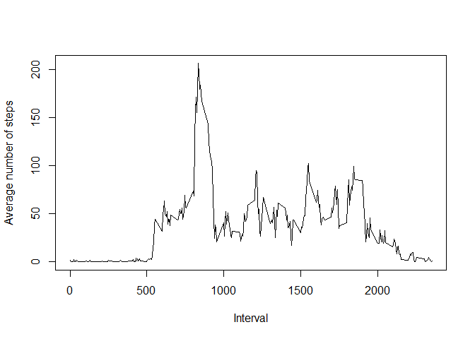

# Reproducible Research: Peer Assessment 1


## Loading and preprocessing the data


```r
df <- read.csv("activity.csv")
head(df)
```

```
##   steps       date interval
## 1    NA 2012-10-01        0
## 2    NA 2012-10-01        5
## 3    NA 2012-10-01       10
## 4    NA 2012-10-01       15
## 5    NA 2012-10-01       20
## 6    NA 2012-10-01       25
```


## What is mean total number of steps taken per day?


```r
df_complete <- df[complete.cases(df),]
total_steps <- aggregate(x= df_complete$steps, 
                         by=list(df_complete$date), FUN="sum", na.rm=TRUE)
total_steps
```

```
##       Group.1     x
## 1  2012-10-02   126
## 2  2012-10-03 11352
## 3  2012-10-04 12116
## 4  2012-10-05 13294
## 5  2012-10-06 15420
## 6  2012-10-07 11015
## 7  2012-10-09 12811
## 8  2012-10-10  9900
## 9  2012-10-11 10304
## 10 2012-10-12 17382
## 11 2012-10-13 12426
## 12 2012-10-14 15098
## 13 2012-10-15 10139
## 14 2012-10-16 15084
## 15 2012-10-17 13452
## 16 2012-10-18 10056
## 17 2012-10-19 11829
## 18 2012-10-20 10395
## 19 2012-10-21  8821
## 20 2012-10-22 13460
## 21 2012-10-23  8918
## 22 2012-10-24  8355
## 23 2012-10-25  2492
## 24 2012-10-26  6778
## 25 2012-10-27 10119
## 26 2012-10-28 11458
## 27 2012-10-29  5018
## 28 2012-10-30  9819
## 29 2012-10-31 15414
## 30 2012-11-02 10600
## 31 2012-11-03 10571
## 32 2012-11-05 10439
## 33 2012-11-06  8334
## 34 2012-11-07 12883
## 35 2012-11-08  3219
## 36 2012-11-11 12608
## 37 2012-11-12 10765
## 38 2012-11-13  7336
## 39 2012-11-15    41
## 40 2012-11-16  5441
## 41 2012-11-17 14339
## 42 2012-11-18 15110
## 43 2012-11-19  8841
## 44 2012-11-20  4472
## 45 2012-11-21 12787
## 46 2012-11-22 20427
## 47 2012-11-23 21194
## 48 2012-11-24 14478
## 49 2012-11-25 11834
## 50 2012-11-26 11162
## 51 2012-11-27 13646
## 52 2012-11-28 10183
## 53 2012-11-29  7047
```

```r
hist(total_steps$x,
     xlab = "Number of Steps",
     main = "Total Steps by Day")
```

<!-- -->

```r
## Calculate mean and median
print ("Mean")
```

```
## [1] "Mean"
```

```r
print(mean(total_steps$x))
```

```
## [1] 10766.19
```

```r
print ("Median")
```

```
## [1] "Median"
```

```r
print(median(total_steps$x))
```

```
## [1] 10765
```


## What is the average daily activity pattern?


```r
splitbyInterval <- aggregate(x = df_complete$steps,
                             by = list(df_complete$interval),
                             FUN = "mean")
plot(splitbyInterval$Group.1,
     splitbyInterval$x,
     type = "l",
     xlab = "Interval",
     ylab = "Average number of steps")
```

<!-- -->

```r
## The maximum number of steps
splitbyInterval[which.max(splitbyInterval$x),]
```

```
##     Group.1        x
## 104     835 206.1698
```

## Imputing missing values
### Number of records with missing values


```r
sum(!complete.cases(df))
```

```
## [1] 2304
```

### Fill missing data


```r
library(plyr)
impute.mean <- function(x) replace(x, is.na(x), mean(x, na.rm = TRUE))
new_df <- ddply(df, ~ interval, transform, steps= impute.mean(steps))
new_df <- new_df[order(new_df$date),]
head(new_df)
```

```
##         steps       date interval
## 1   1.7169811 2012-10-01        0
## 62  0.3396226 2012-10-01        5
## 123 0.1320755 2012-10-01       10
## 184 0.1509434 2012-10-01       15
## 245 0.0754717 2012-10-01       20
## 306 2.0943396 2012-10-01       25
```


```r
total_steps <- aggregate(x= new_df$steps, 
                         by=list(new_df$date), FUN="sum", na.rm=TRUE)
total_steps
```

```
##       Group.1        x
## 1  2012-10-01 10766.19
## 2  2012-10-02   126.00
## 3  2012-10-03 11352.00
## 4  2012-10-04 12116.00
## 5  2012-10-05 13294.00
## 6  2012-10-06 15420.00
## 7  2012-10-07 11015.00
## 8  2012-10-08 10766.19
## 9  2012-10-09 12811.00
## 10 2012-10-10  9900.00
## 11 2012-10-11 10304.00
## 12 2012-10-12 17382.00
## 13 2012-10-13 12426.00
## 14 2012-10-14 15098.00
## 15 2012-10-15 10139.00
## 16 2012-10-16 15084.00
## 17 2012-10-17 13452.00
## 18 2012-10-18 10056.00
## 19 2012-10-19 11829.00
## 20 2012-10-20 10395.00
## 21 2012-10-21  8821.00
## 22 2012-10-22 13460.00
## 23 2012-10-23  8918.00
## 24 2012-10-24  8355.00
## 25 2012-10-25  2492.00
## 26 2012-10-26  6778.00
## 27 2012-10-27 10119.00
## 28 2012-10-28 11458.00
## 29 2012-10-29  5018.00
## 30 2012-10-30  9819.00
## 31 2012-10-31 15414.00
## 32 2012-11-01 10766.19
## 33 2012-11-02 10600.00
## 34 2012-11-03 10571.00
## 35 2012-11-04 10766.19
## 36 2012-11-05 10439.00
## 37 2012-11-06  8334.00
## 38 2012-11-07 12883.00
## 39 2012-11-08  3219.00
## 40 2012-11-09 10766.19
## 41 2012-11-10 10766.19
## 42 2012-11-11 12608.00
## 43 2012-11-12 10765.00
## 44 2012-11-13  7336.00
## 45 2012-11-14 10766.19
## 46 2012-11-15    41.00
## 47 2012-11-16  5441.00
## 48 2012-11-17 14339.00
## 49 2012-11-18 15110.00
## 50 2012-11-19  8841.00
## 51 2012-11-20  4472.00
## 52 2012-11-21 12787.00
## 53 2012-11-22 20427.00
## 54 2012-11-23 21194.00
## 55 2012-11-24 14478.00
## 56 2012-11-25 11834.00
## 57 2012-11-26 11162.00
## 58 2012-11-27 13646.00
## 59 2012-11-28 10183.00
## 60 2012-11-29  7047.00
## 61 2012-11-30 10766.19
```


```r
hist(total_steps$x,
     xlab = "Number of Steps",
     main = "Total Steps by Day")
```

<!-- -->

```r
print ("Mean")
```

```
## [1] "Mean"
```

```r
print(mean(total_steps$x))
```

```
## [1] 10766.19
```

```r
print ("Median")
```

```
## [1] "Median"
```

```r
print(median(total_steps$x))
```

```
## [1] 10766.19
```


## Are there differences in activity patterns between weekdays and weekends?


```r
new_df$weekday <- weekdays(as.POSIXct(new_df$date)) %in% c("Satureday","Sunday")
new_df$weekday[new_df$weekday==FALSE] <- "weekday"
new_df$weekday[new_df$weekday==TRUE] <- "weekend"
new_df$weekday <- as.factor(new_df$weekday)
```


```r
library(ggplot2)
splitbyInterval <- aggregate(x = new_df$steps,
                             by = list(new_df$interval,new_df$weekday),
                             FUN = "mean")
p <- ggplot(splitbyInterval,
            aes(x = splitbyInterval$Group.1, y=splitbyInterval$x))+
     geom_line()+
     labs(x = "Interval", y="Average number of steps")+
     facet_grid(splitbyInterval$Group.2 ~ .)

p
```

<!-- -->

